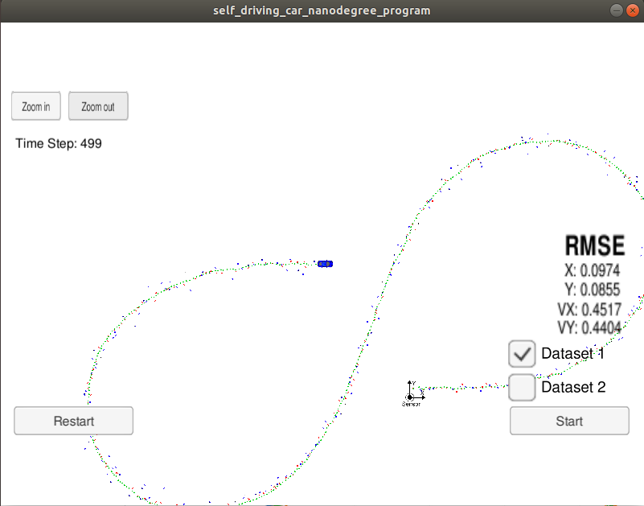

# Extended Kalman Filter

In this project we will utilize a kalman filter to estimate the state of a moving object of interest with noisy lidar and radar measurements.
We will use RMSE as the error metric.

---

## Steps to run the project
> Note: The current version as of 22<sup>th</sup> February, 2019 is tested on Ubuntu. I also assume that you have other [dependencies](#dependencies) installed on your system.
1. Download the simulator for this project from [here](https://github.com/udacity/self-driving-car-sim/releases)
2. Clone this repository using below command on the shell
```bash
git clone https://github.com/rake93/CarND-Extended-Kalman-Filter-Project.git
```
3. Navigate to the project top directory i.e. udacity-ExtendedKalmanFilters.
4. create a directory to build the project using below command and navigate to it
```bash
mkdir build; cd build
```
5. Build the project
```bash
cmake .. && make
```
6. Run the project
```bash
./ExtendedKF
```
7. Since the server is now running, open the simulator and run it. Choose the _Graphics Quality_ as _Fastest_ and Screen Resolution as _800x600_. This configuration ensures the system runs smoothly and does not end up consuming a lot of cpu resources.
8. Choose _Project 1/2: EKF and UKF_ and press _Select_.
9. Finally, check if __Connected!!__ is displayed on the console where you ran _ExtendedKF_ in the 6<sup>th</sup> step and if everything is ok as expected, click _Start_. You will be able to see the car navigate and at the same time, the RMSE for x, y, vx, vy getting updated due to the calculations at each instance or rather input.

<a id="dependencies"></a>
## Installing Dependencies

* cmake >= 3.5
  * All OSes: [click here for installation instructions](https://cmake.org/install/)
* make >= 4.1 (Linux, Mac), 3.81 (Windows)
  * Linux: make is installed by default on most Linux distros
  * Mac: [install Xcode command line tools to get make](https://developer.apple.com/xcode/features/)
  * Windows: [Click here for installation instructions](http://gnuwin32.sourceforge.net/packages/make.htm)
* gcc/g++ >= 5.4
  * Linux: gcc / g++ is installed by default on most Linux distros
  * Mac: same deal as make - [install Xcode command line tools](https://developer.apple.com/xcode/features/)
  * Windows: recommend using [MinGW](http://www.mingw.org/)
* uWebSocketIO => [Download](https://github.com/uWebSockets/uWebSockets) for either Linux or Mac systems. 

## Results

Below is the result for the dataset 1

| State Vector | Calculated Value | Max Threshold |
|----------|-----------|-----------|
|  x | 0.0974 | 0.11 |
|  y | 0.0855 | 0.11 |
| vx | 0.4517 | 0.52 |
| vy | 0.4404 | 0.52 |




> Note: Read below only if you seek additional technical details about Kalman Filters

__Below I discuss about Kalman Filters, their applications, components that constitute the Kalman Filters and other relevant details. It is an optional and lengthy read, and is a work in progress. If I happen to convert into a blog series, will update the links here. Lets get rolling!__

__Q. What is a kalman filter?__ <br>
It's a repetitive/iterative mathematical process that has some inputs plugged into equations to predict/estimate the next value in terms of position, velocity, etc of any object being measured, when the measured values contain unpredicted errors, uncertainty, or variation.

I am sure, an application based explanation would help you understand its usage better.

Suppose that we are building a self-driving car, and for this, we are using sensors to track the pedestrians, vehicles, objects on the road. Now, at every instance, we get a reading from the sensors. Now, our task is to make the car ride on the road without colliding. So, primarily we need to tell the car, what its position and velocity should be at t+1 where t is the current instance. We use the measurements from the sensors and a bunch of equations to predict what the next position and velocity of the car should be. This prediction of position and velocity happens till we reach the destination which means its an iterative/repetitive/continuous process as mentioned in the formal definition. <br>
Now, there are some errors when we depend on sensors, there are errors when mathematical calculations are involved. So, the kalman filter also has a solution to rectify the noise/error (not completely but to a manageable extent).

__Q. What is a typical workflow of the entire process?__ <br>
1. calculate the kalman gain
2. calculate the current estimate
3. recalculate the new error in the estimate
4. repeat the process(1-3) iteratively

_Calculate the Kalman Gain_ <br>
In this step, we use the error in estimate (our calculations) and error in data (measurements, sensor specific) to find the kalman gain. We give more emphasis to the error that is minimum as it would contribute better to ensure we stay close to the actual/true value.

_Calculate the Current Estimate_ <br>
We have the kalman gain that we calculated in the previous step. This kalman gain is fed to the next step along with the previous estimate and the stream of input data we receive at each instance, we calculate the current estimate. The kalman gain will decide how much weight to put on estimate or the input data. So the task of the kalman gain is to put relative importance on the previous estimate and input data.

_Calculate the Error in the Estimate_ <br>
We use the calculated current estimate and the kalman gain to find out the error so that we can feed it back when calculating the kalman gain for the next instance of time.

Now for each of the above step, we get an estimate which says how the object should be moving. Let's look at the mathematics behind this in the below sections.

#### Kalman Gain Calculation

KG = Kalman Gain <br>
E<sub>est</sub> = Error in estimate <br>
E<sub>mea</sub> = Error in data (measurement) <br>

KG = E<sub>est</sub> / (E<sub>est</sub> + E<sub>mea</sub>)

0 <= KG <= 1

#### Current Estimate Calculation

Lets say, <br>
EST<sub>t</sub> = current estimate <br>
EST<sub>t-1</sub> = previous estimate <br>
MES = Measurement <br>
then, 

EST<sub>t</sub> = EST<sub>t-1</sub> + KG[MEA - EST<sub>t-1</sub>]

Higher the KG, higher the E<sub>est</sub> and lower the E<sub>mea</sub> <br>
Lower the KG, lower the E<sub>est</sub> and higher the E<sub>mea</sub>

So, by looking at the above proportions, it should make sense to understand that, over the time, the KG should get smaller and smaller as our estimates will keep getting better, the error in data (measurement) being constant.

#### Error in the Estimate Calculation

E<sub>est_t</sub> = ( E<sub>mea</sub> * E<sub>est_t-1</sub> ) / (E<sub>mea</sub> + E<sub>estP_t-1</sub>)

Sometimes, the above eq<sup>n</sup> can also be written as, <br>
E<sub>est_t</sub> = (1 - KG)(E<sub>est_t-1</sub>)

With the above eq<sup>ns</sup>, we can definitely say that the error in the estimates will always get smaller. 

## References
- https://www.youtube.com/watch?v=5Pu558YtjYM&list=PLgnQpQtFTOGQrZ4O5QzbIHgl3b1JHimN_&index=4
- https://www.bzarg.com/p/how-a-kalman-filter-works-in-pictures/
- https://arxiv.org/pdf/1710.04055.pdf
